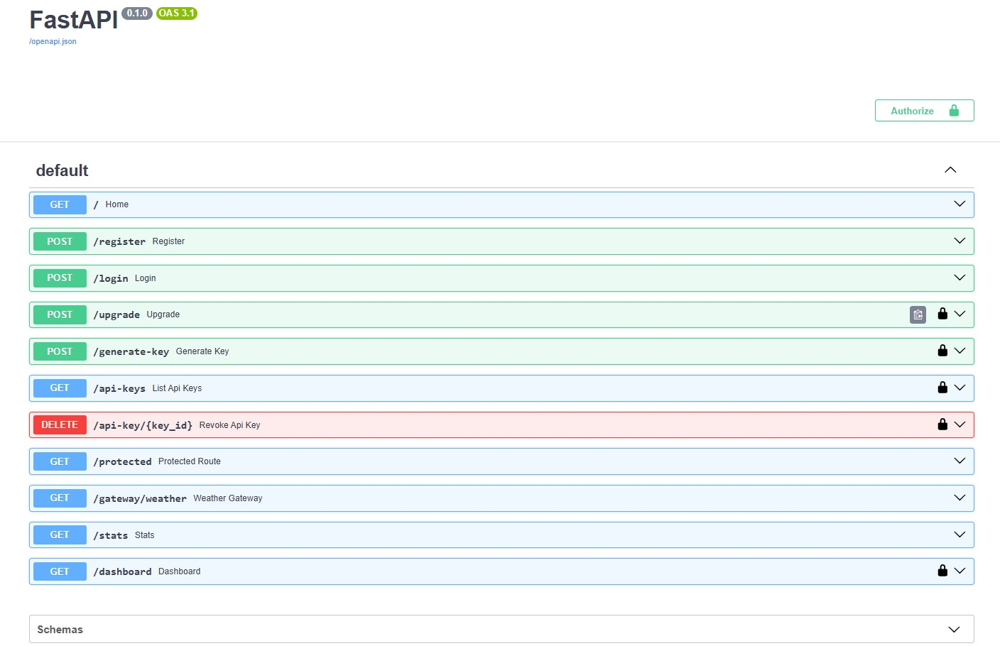
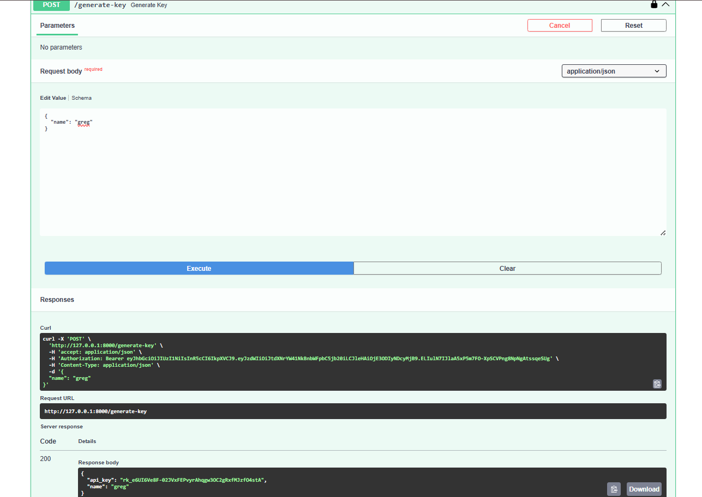
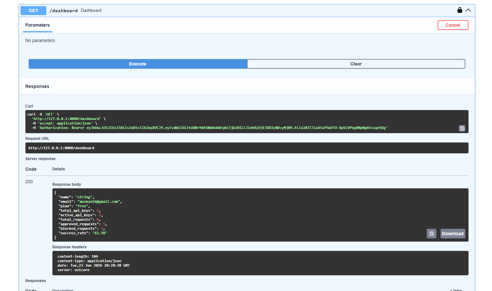
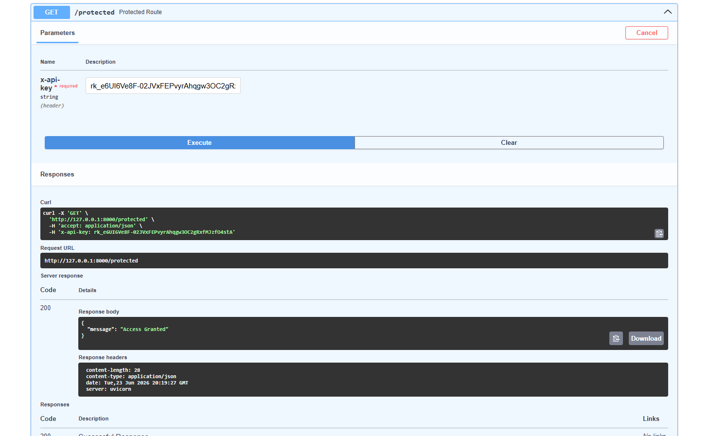

#  RateShield – Intelligent API Gateway with Sliding Window Rate Limiting


RateShield is a production-inspired API Gateway built using **FastAPI**, **Redis**, and **SQLite** that provides secure API key management, JWT authentication, per-user rate limiting, and analytics.

It demonstrates how modern API gateways authenticate users, protect backend services, enforce rate limits, and expose developer dashboards.

---

##  Features

### Authentication & Security

* JWT Authentication
* Password Hashing using bcrypt
* Secure SHA-256 API Key Hashing
* API Key Revocation
* Multiple API Keys per User

### API Gateway

* FastAPI-based API Gateway
* Protected API Endpoints
* Weather Microservice Integration
* API Key Validation Middleware

### Rate Limiting

* Sliding Window Rate Limiting
* Redis Sorted Set Implementation
* Plan-Based Limits (Free / Pro)
* Per-User Rate Tracking

### Developer Dashboard

* Active API Keys
* Total API Keys
* Total Requests
* Approved Requests
* Blocked Requests
* Success Rate Analytics

---
##  Architecture

```text
                 Client
                    │
      JWT / API Key Authentication
                    │
                    ▼
          ┌───────────────────┐
          │   RateShield API  │
          │      Gateway      │
          └───────────────────┘
            │       │       │
            │       │       │
            ▼       ▼       ▼
        Redis    SQLite   Weather Service
   (Rate Limits) (Users) (Microservice)
```

##  Tech Stack

* Python
* FastAPI
* Redis
* SQLite
* SQLAlchemy
* JWT
* Passlib (bcrypt)
* HTTPX
* Uvicorn

---

##  Project Structure

```text
Rateshield/
│
├── screenshots/
│   ├── dashboard.png
│   ├── generate-key.png
│   ├── protected.png
│   └── swagger.jpeg
│
├── static/
│   ├── css/
│   └── js/
│
├── templates/
│
├── auth.py                 # API key authentication
├── database.py             # Database configuration
├── jwt_auth.py             # JWT validation
├── key_security.py         # API key hashing utilities
├── limiter.py              # Sliding Window rate limiter
├── main.py                 # FastAPI application
├── models.py               # SQLAlchemy models
├── plans.py                # Free/Pro plan configuration
├── redis_client.py         # Redis connection
├── schemas.py              # Pydantic schemas
├── security.py             # Password hashing & JWT creation
├── weather_service.py      # Sample backend microservice
├── rateshield.db           # SQLite database
├── README.md
└── .gitignore
```

---

##  Authentication Flow

1. Register a user
2. Login using email/password
3. Receive JWT Access Token
4. Generate API Key
5. Use API Key to access protected APIs
6. Sliding Window Rate Limiter validates each request

---

##  Dashboard

Each authenticated developer can view:

* Current subscription plan
* Active API Keys
* Total API Keys
* Request Statistics
* Success Rate

---

##  Running the Project

### Clone Repository

```bash
git clone https://github.com/muskan-g72/Rateshield.git
cd Rateshield
```

### Install Dependencies

```bash
pip install -r requirements.txt
```

### Start Redis

```bash
redis-server
```

### Run Weather Service

```bash
py -m uvicorn weather_service:app --port 8001
```

### Run API Gateway

```bash
py -m uvicorn main:app --reload
```

---

## Screenshots

### Swagger UI



### Generate API Key



### Dashboard



### Protected Endpoint



##  Future Improvements

* PostgreSQL
* Docker Compose
* Prometheus & Grafana
* GitHub Actions CI
* Pytest Test Suite
* Public Cloud Deployment

---

